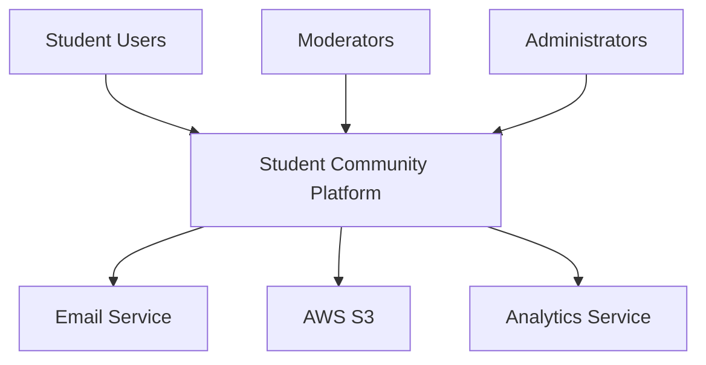
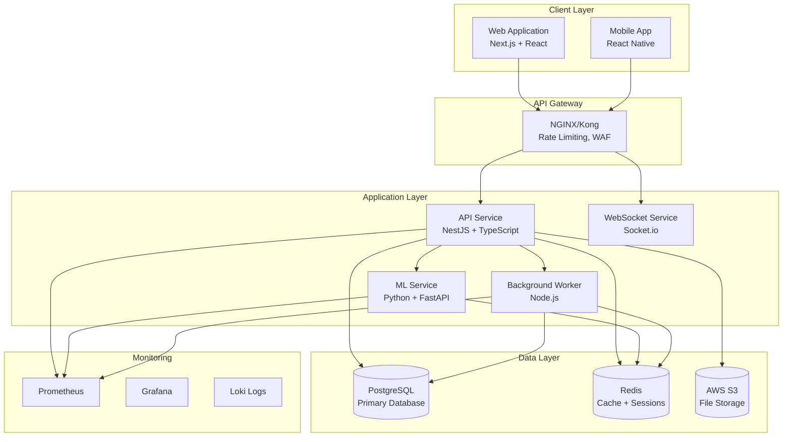
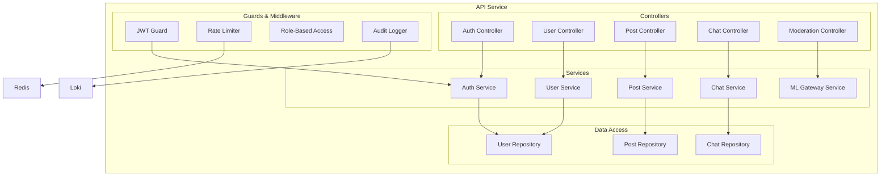
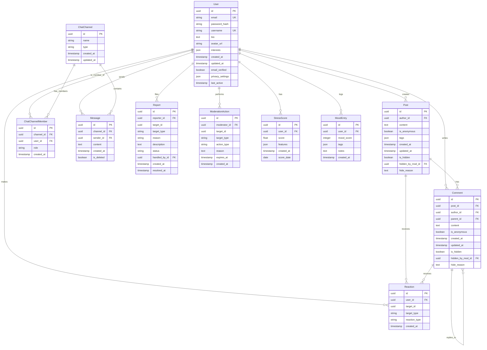
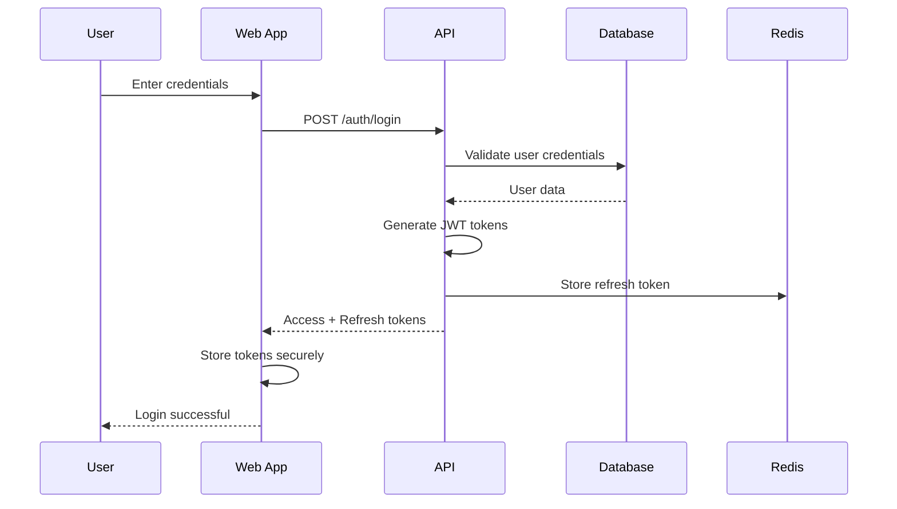
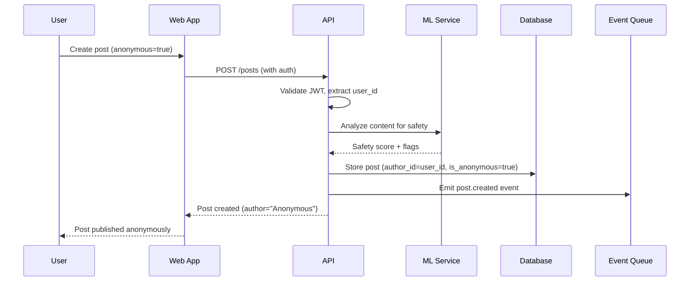
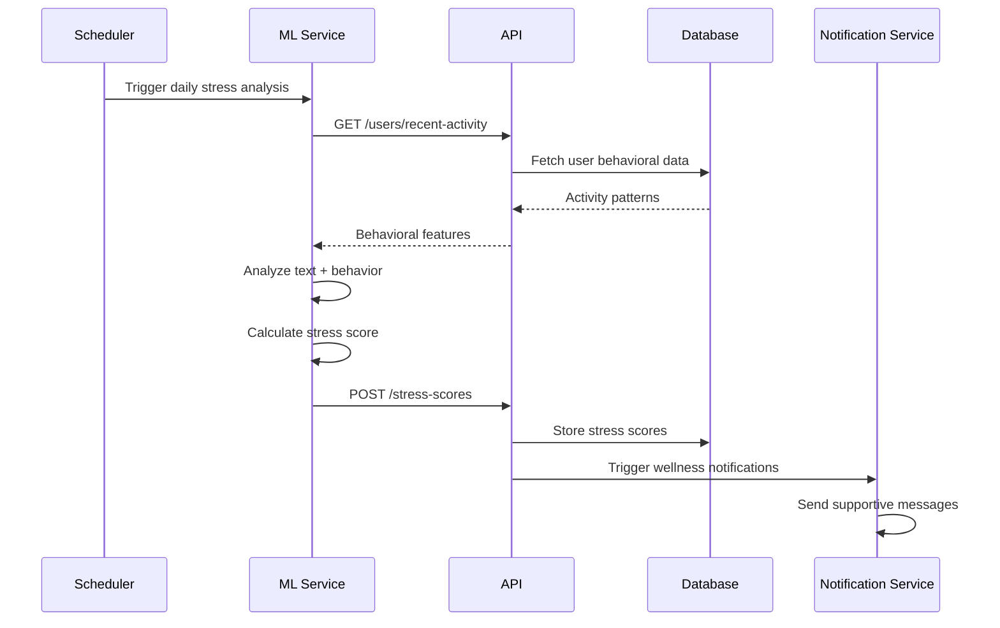
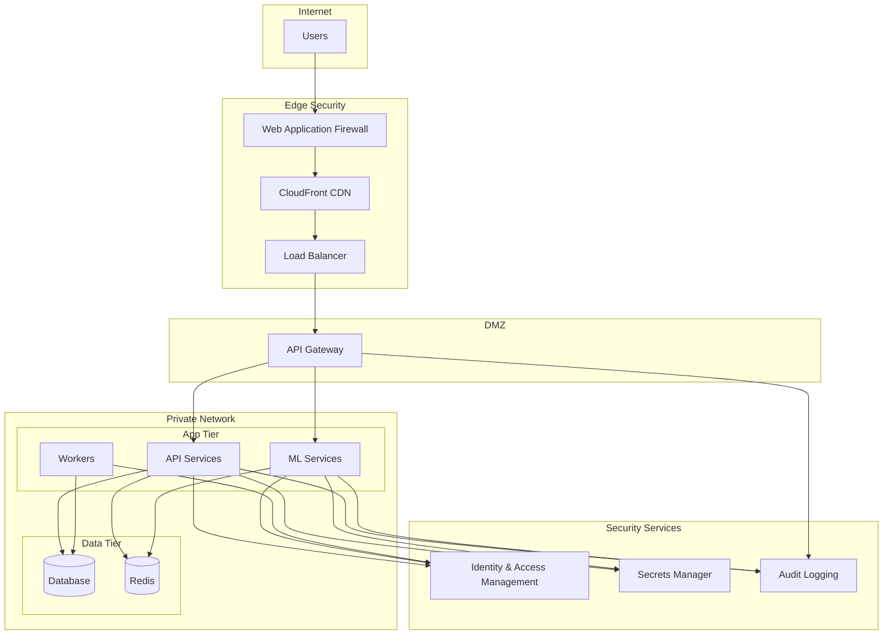

# Student Community Platform - System Architecture

## Overview

This document outlines the end-to-end architecture for a privacy-first, scalable Student Community Platform designed to foster safe, supportive academic communities while maintaining strict privacy standards and data minimization principles.

## Architecture Principles

### Privacy-First Design
- **Data Minimization**: Collect only essential data required for functionality
- **Consent-Driven**: Explicit user consent for all data processing activities
- **Pseudonymization**: Personal identifiers separated from behavioral data
- **Right to Erasure**: Complete data deletion capabilities
- **Transparency**: Clear data usage policies and retention windows

### Security & Trust
- **Zero-Trust Network**: No implicit trust between services
- **Defense in Depth**: Multiple security layers
- **Least Privilege**: Minimal required permissions
- **Audit Everything**: Comprehensive logging and monitoring

### Scalability & Performance
- **Microservices Architecture**: Independent, scalable services
- **Event-Driven Design**: Asynchronous processing where possible
- **Caching Strategy**: Multi-layer caching for performance
- **Horizontal Scaling**: Auto-scaling based on demand

## System Context (C4 Level 1)



### External Dependencies
- **Email Service**: User verification and notifications
- **AWS S3**: File storage for avatars and resources
- **Analytics Service**: Anonymized usage analytics

## Container Diagram (C4 Level 2)



## Component Diagram (C4 Level 3) - API Service



## Data Model (ERD)



## Event Taxonomy

### User Events
- `user.registered` - New user account created
- `user.email_verified` - Email verification completed
- `user.profile_updated` - Profile information changed
- `user.login` - User authentication successful
- `user.logout` - User session ended

### Content Events
- `post.created` - New post published
- `post.updated` - Post content modified
- `post.deleted` - Post removed
- `comment.created` - New comment added
- `comment.updated` - Comment modified
- `reaction.added` - User reacted to content
- `reaction.removed` - User removed reaction

### Chat Events
- `message.sent` - Chat message delivered
- `channel.created` - New chat channel established
- `user.joined_channel` - User joined chat
- `user.left_channel` - User left chat

### Moderation Events
- `report.filed` - Content reported by user
- `content.hidden` - Content hidden by moderator
- `user.suspended` - User account suspended
- `user.banned` - User account banned

### Wellness Events
- `mood.logged` - User logged mood entry
- `stress_score.calculated` - ML stress score computed
- `banner.shown` - Wellness banner displayed
- `resource.accessed` - Wellness resource viewed

### System Events
- `rate_limit.exceeded` - Rate limit violation
- `security.suspicious_activity` - Potential security threat
- `system.error` - Application error occurred

## Sequence Diagrams

### User Login Flow


### Anonymous Post Creation


### ML Stress Scoring Pipeline


## Risk Register & Mitigations

### Privacy Risks
| Risk | Impact | Probability | Mitigation |
|------|--------|-------------|------------|
| Data breach exposing PII | High | Medium | Encryption at rest/transit, access controls, audit logs |
| Unauthorized data access | High | Low | Zero-trust architecture, RBAC, regular access reviews |
| Data retention violations | Medium | Low | Automated deletion, retention policies, compliance monitoring |

### Security Risks
| Risk | Impact | Probability | Mitigation |
|------|--------|-------------|------------|
| SQL injection attacks | High | Low | Parameterized queries, input validation, WAF |
| DDoS attacks | Medium | Medium | Rate limiting, CDN, auto-scaling |
| JWT token compromise | High | Low | Short expiry, refresh rotation, secure storage |

### Operational Risks
| Risk | Impact | Probability | Mitigation |
|------|--------|-------------|------------|
| Service downtime | Medium | Medium | Multi-AZ deployment, health checks, circuit breakers |
| Data loss | High | Low | Automated backups, PITR, disaster recovery |
| Performance degradation | Medium | Medium | Monitoring, auto-scaling, caching |

### Content Safety Risks
| Risk | Impact | Probability | Mitigation |
|------|--------|-------------|------------|
| Harmful content spread | High | Medium | ML content filtering, human moderation, reporting system |
| False stress detection | Medium | Medium | Human oversight, transparent thresholds, opt-out options |
| Privacy in anonymous posts | Medium | Medium | Secure anonymization, audit trails, access controls |

## Scaling Plan

### Horizontal Pod Autoscaling (HPA)
```yaml
# API Service HPA
apiVersion: autoscaling/v2
kind: HorizontalPodAutoscaler
metadata:
  name: api-hpa
spec:
  scaleTargetRef:
    apiVersion: apps/v1
    kind: Deployment
    name: api-service
  minReplicas: 2
  maxReplicas: 20
  metrics:
  - type: Resource
    resource:
      name: cpu
      target:
        type: Utilization
        averageUtilization: 70
  - type: Resource
    resource:
      name: memory
      target:
        type: Utilization
        averageUtilization: 80
```

### Database Scaling Strategy
- **Read Replicas**: 2-3 read replicas for query distribution
- **Connection Pooling**: PgBouncer for connection management
- **Partitioning**: Time-based partitioning for posts and messages
- **Archival**: Move old data to cold storage after retention period

### Caching Strategy
- **L1 Cache**: Application-level caching (Node.js memory)
- **L2 Cache**: Redis for session data and frequently accessed content
- **L3 Cache**: CDN for static assets and public content
- **Cache Invalidation**: Event-driven cache updates

### Performance Targets
- **API Response Time**: p95 < 200ms, p99 < 500ms
- **WebSocket Latency**: < 100ms for real-time messages
- **ML Inference**: < 150ms for text analysis
- **Database Queries**: < 50ms for simple queries, < 200ms for complex

## Zero-Trust Network Architecture



### Security Controls
- **Network Segmentation**: Services isolated in separate subnets
- **Service Mesh**: Istio for service-to-service encryption
- **Certificate Management**: Automated TLS certificate rotation
- **Identity Verification**: mTLS for service authentication
- **Traffic Monitoring**: Real-time network traffic analysis

## Data Retention & Pseudonymization

### Retention Windows
- **Raw User Content**: 30 days (then pseudonymized)
- **Behavioral Features**: 90 days
- **Aggregated Analytics**: 2 years
- **Audit Logs**: 7 years (compliance requirement)
- **User Accounts**: Until deletion request

### Pseudonymization Process
1. **Immediate**: Replace direct identifiers with pseudonyms
2. **30 Days**: Remove quasi-identifiers from content
3. **90 Days**: Aggregate behavioral data, delete individual records
4. **1 Year**: Archive aggregated data to cold storage

### Data Minimization
- **Collection**: Only collect data necessary for functionality
- **Processing**: Process only with explicit consent
- **Storage**: Store in least identifiable form possible
- **Sharing**: No data sharing with third parties

This architecture provides a solid foundation for building a privacy-first, scalable student community platform that prioritizes user safety and data protection while maintaining high performance and reliability.